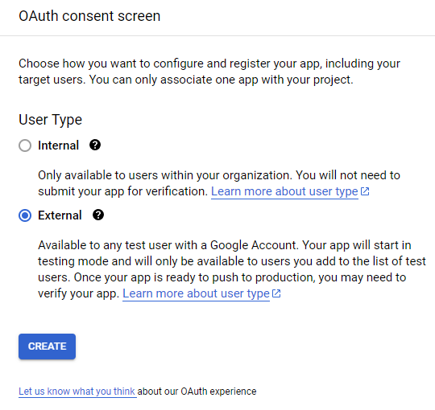

LINK: https://console.cloud.google.com/apis/credentials/consent?project=reference-tine-426104-f0

## OAuth consent screen

Click on External and hit the blue `CREATE` button.

____________________________________________

 

 

## Edit app registration - OAuth consent screen

Enter a name in the "App Name" text-entry box and enter your own email in the "User Support Email" text-entry box.

Scroll down to the "Developer contact information" section. 
Enter your email again into the "Email Address" text-entry box with the subtext: "*These email addresses are for Google to notify you about any changes to your project.*"

**Leave everything else blank.**

✔️ Select the `Save and Continue` button at the bottom of the page, **leaving everything else blank**.

____________________________________________

 

 

## Edit app registration - Scopes

Select the `ADD OR REMOVE SCOPES` button to open a table of scopes. The following table can be found on page 3. (results 22-27)

|add scope| API | Scope | User-facing description |
|---------|-----|-------|-------------------------|
|☐|Google Forms API | .../auth/drive | See, edit, create, and delete all of your Google Drive files|
|☐|Google Forms API | .../auth/drive.file | See, edit, create, and delete only the specific Google Drive files you use with this app|
|☐|Google Forms API | .../auth/forms.body | See, edit, create, and delete all your Google Forms forms|
|☐|Google Forms API | .../auth/drive.readonly | See and download all your Google Drive files|
|☑️|Google Forms API | .../auth/forms.body.readonly | See all your Google Forms forms|
|☑️|Google Forms API | .../auth/forms.responses.readonly | See all responses to your Google Forms forms|

Select the two rows above (26: `forms.body.readonly` and 27: `forms.responses.readonly`)

Scroll down and select the blue `UPDATE` button at the bottom to close the table and return to the previous page (Edit app registration - Scopes)

✔️ Select the `SAVE AND CONTINUE` button at the bottom of the page.

____________________________________________

 

 

## Edit app registration - Test users

Click the `+ ADD USERS` button. 

Add the Gmail account that owns the Google Form OR has viewing access to the Google Form's results.

✔️ Scroll to the bottom and select the `SAVE AND CONTINUE` button.

____________________________________________

 

 

## Edit app registration - Summary

Here you will find a summary of the previous selections. 

✔️ Select the `BACK TO DASHBOARD` button to return to your dashboard and create an OAuth token. You can read more about creating an OAuth token in the [get_an_OAuth_token.md](get_an_OAuth_token.md) file.

 

 

👏 Congradulations 🎉🎊

You have completed the OAuth Consent Screen and **PASSED**!
