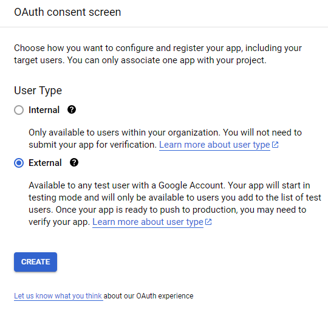

# Acess GoogleForms Results via Python
Access Google Forms results via Python using GoogleFormsAPI

## Running The Script

###### Note: To use the GoogleFormsAPI you will need an OAuth 2.0 token. Read [Getting an OAuth Token](#Getting-an-OAuth-Token) for more info. Once you've created an OAuth 2.0 token, google will give you access to a `client-ID` and `client-secret`.

1. Download the [credentials.json](credentials.json) file and replace the `client-ID` and `client-secret` with your own.

2. Run `python3 main.py` to download the Google Forms data and display it locally as a CSV file. Note: this will require you to whitelist your email account and sign in when prompted so that the script can pull the submissions on your behalf.

 

_________________________

 

 

## Getting an OAuth Token

Go to [Google Cloud Consol](https://console.cloud.google.com/)s website and select the `APIs & Services` button.

Navigate to the `credentials` tab and select the `+ CREATE CREDENTIALS` button to reveal a drop-down of 4 items. 

Select the second item (`OAuth client ID`, sub-text: "Requests user consent so your app can access the user's data")

This will bring you to the "Create OAuth client ID" page. **However**, in order to be able to continue you need to fill out the `OAuth consent screen` and pass the screening process. The step-by-step process is in the [OAuth consent screen](#OAuth-consent-screen) section.

Finally, click the application type dropdown, select `Desktop app`, and name it whatever you'd like.

Click the blue `CREATE` button at the bottom of the page.

A pop-up window will appear with your `client-ID` and `client-secret`. Save both somewhere secure.

 

_________________________

 

 

## OAuth consent screen

Click on External and hit the blue `CREATE` button.

____________________________________________

 

 

## Edit app registration - OAuth consent screen

Enter a name in the "App Name" text-entry box and enter your own email in the "User Support Email" text-entry box.

Scroll down to the "Developer contact information" section. 
Enter your email again into the "Email Address" text-entry box with the subtext: "*These email addresses are for Google to notify you about any changes to your project.*"

**Leave everything else blank.**

✔️ Select the `Save and Continue` button at the bottom of the page, **leaving everything else blank**.

____________________________________________

 

 

## Edit app registration - Scopes

Select the `ADD OR REMOVE SCOPES` button to open a table of scopes. The following table can be found on page 3. (results 22-27)

|add scope| API | Scope | User-facing description |
|---------|-----|-------|-------------------------|
|☐|Google Forms API | .../auth/drive | See, edit, create, and delete all of your Google Drive files|
|☐|Google Forms API | .../auth/drive.file | See, edit, create, and delete only the specific Google Drive files you use with this app|
|☐|Google Forms API | .../auth/forms.body | See, edit, create, and delete all your Google Forms forms|
|☐|Google Forms API | .../auth/drive.readonly | See and download all your Google Drive files|
|☑️|Google Forms API | .../auth/forms.body.readonly | See all your Google Forms forms|
|☑️|Google Forms API | .../auth/forms.responses.readonly | See all responses to your Google Forms forms|

Select the two rows above (26: `forms.body.readonly` and 27: `forms.responses.readonly`)

Scroll down and select the blue `UPDATE` button at the bottom to close the table and return to the previous page (Edit app registration - Scopes)

✔️ Select the `SAVE AND CONTINUE` button at the bottom of the page.

____________________________________________

 

 

## Edit app registration - Test users

Click the `+ ADD USERS` button. 

Add the Gmail account that owns the Google Form OR has viewing access to the Google Form's results.

✔️ Scroll to the bottom and select the `SAVE AND CONTINUE` button.

____________________________________________

 

 

## Edit app registration - Summary

Here you will find a summary of the previous selections. 

✔️ Select the `BACK TO DASHBOARD` button to return to your dashboard and create an OAuth token. You can read more about creating an OAuth token in the [Getting an OAuth Token](#Getting-an-OAuth-Token) section of the README.

 

 

👏 Congradulations 🎉🎊

You have completed the OAuth Consent Screen and **PASSED**!
